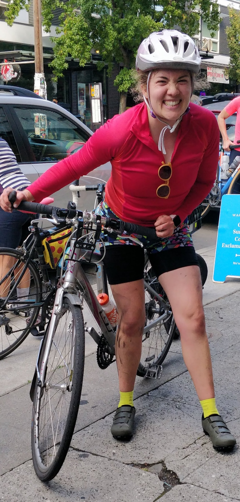

```{r setup, include=FALSE}
knitr::opts_chunk$set(echo = FALSE)
```

{width=55%} 

{width=45%}

and maybe this works?


```{r image_grobs, fig.show = "hold", out.width = "50%", fig.align = "default"}

# this stuff is not currently working to display photos side by side like I want...it's a WIP
#knitr::include_graphics("caro-headshot.jpg")

#

```